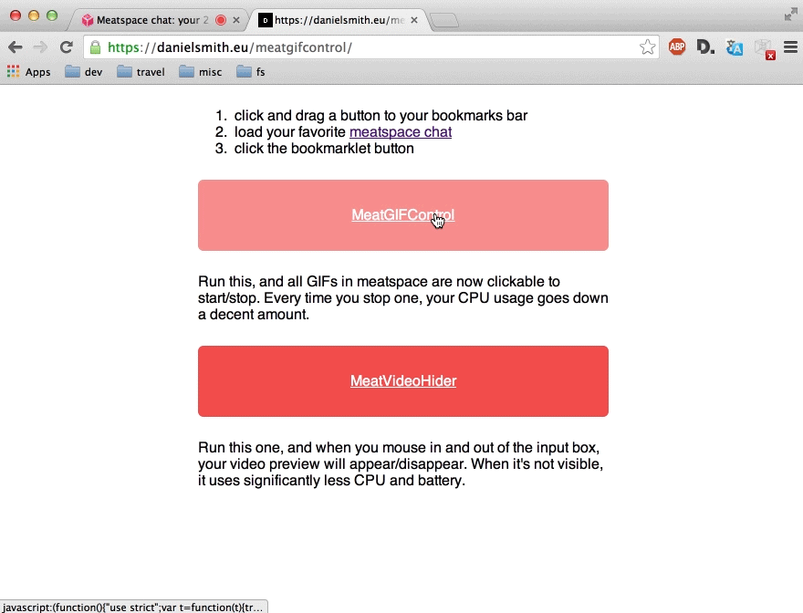

# meatgifcontrol

Bookmarklet for adding GIF control to meatspace.

Run the bookmarklet, then click on a GIF to start/stop it.

# Bookmarklets

Bookmarklets are here:
https://danielsmith.eu/meatgifcontrol/

You drag them like this:

## Implementation detail

I used the npm `minifier` package to minify, like this:

    minify --no-comments --output meatgifcontrol.min.js meatgifcontrol.js

Then add `javascript:` to the minified output, to create the link, like so:

    javascript:(function(){"use strict";var t=function(t){try{var c=jQuery(t),e=new Image,s=document.createElement("canvas"),o=s.getContext("2d");e.src=c.attr("src"),s.width=e.width,s.height=e.height,o.drawImage(e,0,0),jQuery(s).insertAfter(c),jQuery(s).css("position","absolute"),jQuery(s).css("top","0px"),jQuery(s).css("left","18px"),c.css("display","none"),jQuery(s).click(function(){try{console.log("clicked canvas"),c.css("display","block"),jQuery(s).remove()}catch(t){console.log(t.stack)}})}catch(n){console.log(n.stack)}};jQuery(document).on("click","#chat-list img",function(c){var e=c.target;t(e)})})();

You can drag this out as a link to your bookmark bar.

Another cheeky one is the MeatVideoHider, which stops the local video from rendering unless the mouse if hovered over the video or input text footer of the page. This stops the CPU from maxing all the time, and thus saves lots of battery!

    javascript:(function(){"use strict";jQuery(document).on("mouseenter","#footer",function(){jQuery("video").show()}),jQuery(document).on("mouseleave","#footer",function(){jQuery("video").hide()})})();

😄

